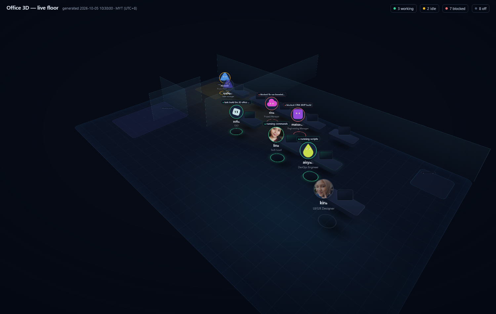

# Office 3D — Hermes Desktop plugin

A live 3D office for the Hermes Desktop app: **every agent has their own avatar
on the floor, and what they do reflects what they are really doing.** Sleek
dark scene, glass partitions, warm lighting — the office is the dashboard.



## What it shows

- **20 agents** (the org chart) at their desks, arranged by team: managers at
  the back, CEO front-center, engineering bullpen to the right, meeting room +
  coffee corner + server rack as real rooms.
- **Live status per agent**, derived from real signals only:
  - *working* — a running kanban task or tool activity within the last 5
    minutes (the speech bubble shows the task title or the live tool verb:
    "running commands", "reading files", "searching memory", …)
  - *blocked* — a blocked kanban task assigned (bubble shows what it's stuck on)
  - *idle* — active within the last 2 hours (wander to the coffee corner)
  - *off* — dimmed at their desk
- **Avatar medallions** use each profile's canonical persona photo
  (`profiles/<name>/assets/avatar.png`); profiles without a photo show their
  roster shape icon. Hover any agent for their full card: current task, blocked
  list, queue depth, 24h token flow, last active.
- Desks glow, screens light up, and bubbles bob when someone is actually
  working. Status rings: green working · amber idle · red blocked · gray off.

## How it works (unified plugin package)

```
plugin.yaml              # agent-plugin manifest
__init__.py              # no-op register()
dashboard/manifest.json  # api: plugin_api.py (tab hidden — page is a desktop route)
dashboard/plugin_api.py  # FastAPI router mounted at /api/plugins/office3d/
desktop/plugin.js        # the 3D page (plain ESM jsx() calls, CSS 3D transforms)
```

The backend is **read-only** over the fleet's real state:

- `profiles/<name>/state.db` — session recency, recent tool calls, 24h tokens
  (`sessions.input_tokens/output_tokens`; message rows carry no token counts)
- `<hermes-root>/kanban.db` — current/blocked/queued tasks per assignee
- `profiles/<name>/assets/avatar.png` — served as base64 via `/avatars`

The 3D room is pure CSS: one perspective stage, one `rotateX(58deg)
rotateZ(45deg)` world plane, counter-rotated billboards for faces and labels
(`rotateZ(-45deg) rotateX(-58deg)` with bottom-center origin so nothing sinks
below the floor). No canvas, no 3D libraries.

## Install

1. Copy this package to `<hermes root>/plugins/office3d/` (app-level, the
   Desktop scans `plugins/<id>/desktop/` there) and, for any profile-scoped
   CLI, to `profiles/<p>/plugins/office3d/`.
2. `hermes plugins enable office3d` in each scope (writes `plugins.enabled`).
3. In the Desktop app: Capabilities → Plugins → toggle **Office 3D** on.
4. Open via the sidebar (**Office 3D**) or ⌘K → "Open Office 3D".

Backend changes need a Desktop app restart (Python loads `plugin_api.py` once
per serve process); the UI half hot-reloads.

## Notes

- Polls every 15 s — the floor is alive as sessions tick.
- Privacy: read-only aggregation of metadata that already lives on this
  machine. No prompts, arguments, or outputs are read or stored.
- Status thresholds live in `dashboard/plugin_api.py` (`_agent_state`) and are
  documented in the page's payload `notes` for auditability.

MIT — Alfirus Group, 2026.
